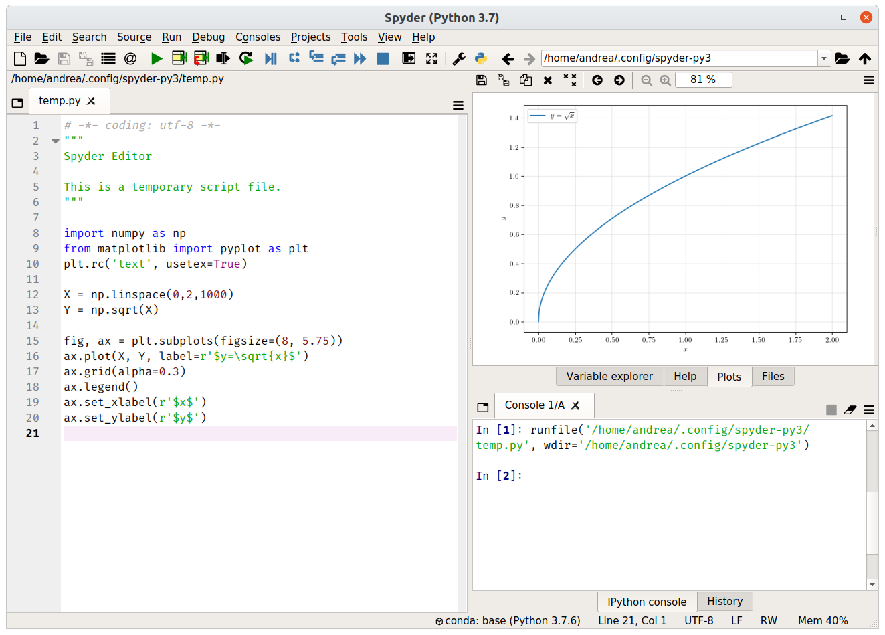

# Introduction to Python and Numerical Methods for Social Networks

This repository is a collection of material related to the course in [Social and Economic Networks](http://didattica.unibocconi.eu/ts/tsn_anteprima.php?cod_ins=20462&anno=2020&IdPag=6203), offered to Master's students at [Bocconi University](https://www.unibocconi.eu).

## Setup instructions

In order to use Python on your computer, you have to download it.
However, "[base Python](https://www.python.org/)" only consists of a small set of core functions.
This is not very useful for us.
Instead, we need Python _and_ many related packages, each one of them being suited for different tasks.
The most popular and reliable way to obtain everything we need is by downloading and installing Anaconda.
[Anaconda](https://www.anaconda.com/) is a _distribution_ of Python and Python packages.
It is based on the program `conda`, which is the package manager.
All the packages that we need are included in Anaconda, out of the box.

Head over to [https://www.anaconda.com/](https://www.anaconda.com/) and download the appropriate installer for your Operating System (OS).
You will be asked whether to install Python 3.x or Python 2.x.
You should choose Python 3.x, as [Python 2 has reached end-of-life](https://www.python.org/doc/sunset-python-2/) and is offered only for compatibility for legacy developers (not us).
Once you downloaded the installer, follow the [installation instructions](https://docs.anaconda.com/anaconda/install/).

Once you installed Anaconda, you should be able to open Spyder, the Integrated Development Environment (IDE) provided with Anaconda.
If you used Matlab or RStudio in the past, Spyder will look familiar.

If you are able to open Spyder, then you are all set and ready to read further.

## What are these `.ipynb` files I can find here?

Glad you asked!
These are Jupyter Notebooks.
In essence, they are web documents that embed both code and text.
They are convenient because GitHub renders these notebooks in a web browser.
This means I can share code and explain it in one single document.
It also means I do not have to fiddle with LaTeX, code listings and screenshots.

If you are interested in understanding how to create a Jupyter Notebook, read the [mini-tutorial](./jupyter_notebooks_tutorial.md) I wrote or check the [official documentation](https://jupyter-notebook.readthedocs.io/en/stable/index.html).
